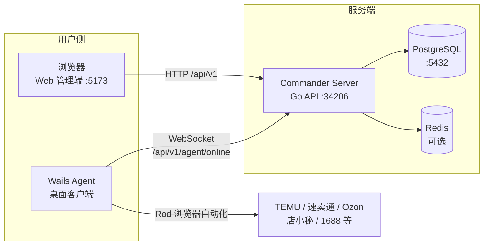

# Agenta

**多平台跨境电商自动化上货与 AI 助手 — 全栈 Monorepo**

[](https://go.dev/)
[](https://vuejs.org/)
[](https://wails.io/)

> 仓库地址：[https://github.com/2836240651/agenta](https://github.com/2836240651/agenta)  
> 最后更新：**2026-07-11**

Agenta（内部代号 **Commander**）是一套面向跨境电商场景的**全栈自动化系统**，由 **Web 管理端**、**Go 后端服务**、**Wails 桌面 Agent** 三端组成：

- **Web**：任务配置、店铺管理、工单、AI 对话、营销落地页
- **Server**：REST API、JWT 鉴权、Agent WebSocket 调度、PostgreSQL 持久化
- **Agent**：本地 Chromium 自动化，执行 TEMU / 速卖通 / Ozon / 店小秘 等平台上货

用户在 Web 上传 Excel 或配置任务 → Server 持久化并下发给在线 Agent → Agent 完成浏览器自动化 → 状态回传 Web 展示与重试。

---

## 目录

- [系统架构](#系统架构)
- [核心能力](#核心能力)
- [技术栈](#技术栈)
- [快速开始](#快速开始)
- [环境要求](#环境要求)
- [本地开发](#本地开发)
- [端口约定](#端口约定)
- [目录结构](#目录结构)
- [子项目说明](#子项目说明)
- [配置说明](#配置说明)
- [生产构建](#生产构建)
- [相关文档](#相关文档)
- [Git 协作](#git-协作)
- [安全须知](#安全须知)
- [常见问题](#常见问题)

---

## 系统架构



| 组件 | 角色 | 说明 |
|------|------|------|
| **Web** | 管理端网站 | 营销落地页、登录注册、工作台、自动上货、工单、AI 聊天 |
| **Server** | 后端 API + 调度 | REST 接口、JWT 鉴权、Agent WebSocket、定时任务、AI 接入 |
| **Agent** | 桌面执行端 | 内嵌 Chromium，多平台浏览器自动化，接收 Server 下发的上货任务 |

---

## 核心能力

### Web 管理端

- **营销落地页**（`/#/`）：品牌展示、覆盖平台列表、中英文切换
- **用户体系**：登录、注册、个人中心、邀请码（管理员）
- **工作台**：多平台入口矩阵（TEMU、Amazon、TikTok、Walmart、AliExpress、拼多多、1688、抖音等）
- **自动上货**：Agent 选择、店铺/类目配置、Excel 批量上货、任务列表与重试
- **AI 助手**：基于 TDesign Chat 的流式对话
- **工单与支持**：提交工单、工单列表与详情
- **管理后台**（`/admin`）：用户管理、邀请码、Agent 版本、平台配置

### Server 后端

- REST API 前缀：`/api/v1`
- 模块：`user`、`invitation`、`agent`、`sale`、`ticket`、`ai`、`reptile`、`express`、`openapi`
- Agent WebSocket 长连接与任务分发
- PostgreSQL 持久化；可选 Redis 会话续期；Wire 依赖注入；Cron 定时任务

### Agent 桌面端

- **Wails v2** 桌面应用，内嵌 Vue3 前端（当前版本 **4.0.2**）
- **Rod** 驱动 Chromium，支持有头/无头模式
- 多平台工厂：店小秘（DXM）、速卖通（AliExpress）、Ozon
- WebSocket 自动重连，主页显示 **ACTIVE** 表示已注册
- 自更新、定时任务、本地配置与日志

---

## 技术栈

| 子项目 | 目录 | 技术 |
|--------|------|------|
| **Web** | [`commander-web-t260220-main/commander-web-t260220-main`](./commander-web-t260220-main/commander-web-t260220-main) | Vue 3、Vite 7、Vue Router（Hash）、Pinia、TDesign Vue Next、Tailwind CSS 4、vue-i18n |
| **Server** | [`commander-server-t260220-main/commander-server-t260220-main`](./commander-server-t260220-main/commander-server-t260220-main) | Go 1.25、Gin、GORM、PostgreSQL、Redis、Gorilla WebSocket、Wire、Viper、Zap |
| **Agent** | [`commander-agent-t260220-main/commander-agent-t260220-main`](./commander-agent-t260220-main/commander-agent-t260220-main) | Wails v2、Go、Vue 3 + TypeScript、shadcn-vue、Tailwind CSS 4、Rod |

Web 与 Agent 前端使用 **pnpm**；Server 使用 **Go Modules**。

---

## 快速开始

### 1. 克隆仓库

```bash
git clone https://github.com/2836240651/agenta.git
cd agenta
```

### 2. 准备依赖

| 依赖 | 版本建议 | 用途 |
|------|----------|------|
| Go | ≥ 1.25 | Server、Agent 后端 |
| Node.js | ≥ 20 | Web、Agent 前端 |
| pnpm | ≥ 9 | 前端包管理 |
| PostgreSQL | ≥ 14 | Server 数据持久化 |
| Wails CLI | v2 | Agent 桌面应用开发与构建 |
| Redis | 可选 | 登录态滑动续期（生产推荐） |

安装 Wails CLI（Agent 必需）：

```bash
go install github.com/wailsapp/wails/v2/cmd/wails@latest
```

### 3. 配置 Server

复制配置模板并填写数据库等信息（**勿将含密钥的文件提交 git**）：

```bash
cd commander-server-t260220-main/commander-server-t260220-main
cp etc/config/config-dev.yaml etc/config/config-dev.local.yaml   # 按需调整
```

开发环境设置 `ENV=dev`，Server 将读取 `etc/config/config-dev.yaml`。

### 4. 启动三端

**终端 1 — Server**

```bash
cd commander-server-t260220-main/commander-server-t260220-main
go run .
```

**终端 2 — Web**

```bash
cd commander-web-t260220-main/commander-web-t260220-main
pnpm install
pnpm dev
```

浏览器访问：<http://localhost:5173>

**终端 3 — Agent**

```bash
cd commander-agent-t260220-main/commander-agent-t260220-main
wails dev
```

Agent 通过 WebSocket 注册：`ws://localhost:34206/api/v1/agent/online`，主页应显示 **ACTIVE**。

> Windows 开发者可使用一键脚本，见下方 [本地开发](#本地开发)。

---

## 环境要求

### 通用

- 操作系统：Windows 10+（Agent 开发与发布）、Linux（Server 生产部署）
- 网络：Agent 需能访问目标电商平台与 Commander Server

### Windows 本地工具链（可选）

本机若已配置 Fish 开发环境，以下变量可直接使用：

| 变量 | 说明 |
|------|------|
| `FISHAGENT_ROOT` | 工作区根目录 |
| `FISHAGENT_ENV_ROOT` | 工具链根目录（Go、Node、pnpm、PostgreSQL 等） |
| `ENV` | 设为 `dev` 时 Server 读取 `config-dev.yaml` |

PostgreSQL 数据目录与启动脚本位于 `FISHAGENT_ENV_ROOT` 对应路径；详见 [`AGENTS.md`](./AGENTS.md)。

---

## 本地开发

### 一键三端重启（Windows 推荐）

```powershell
powershell -NoProfile -ExecutionPolicy Bypass -File scripts/restart-commander.ps1
```

脚本会：停止旧进程 →（可选）构建 → 打开 Server / Web / Agent 三个控制台窗口。

| 参数 | 说明 |
|------|------|
| `-SkipBuild` | 跳过构建，直接启动 |
| `-SkipPostgres` | 不检查/启动 PostgreSQL |
| `-UseAgentExe` | 使用已编译的 `Agent.exe` 而非 `wails dev` |
| `-WebProductionBuild` | Web 使用生产构建 |

### 开发约定摘要

| 子项目 | 包管理 | 关键约定 |
|--------|--------|----------|
| Web | `pnpm dev` / `pnpm build` | Vite 代理 `/api` → `localhost:34206` |
| Server | `go run .` | 配置在 `etc/config/`，密钥勿提交 |
| Agent | `wails dev` / `wails build` | **禁止** `go run`；Go 方法变更后执行 `wails generate module` |

---

## 端口约定

| 服务 | 端口 | 访问方式 |
|------|------|----------|
| Web 管理端 / 营销页 | **5173** | 浏览器 `http://localhost:5173` |
| Agent 前端 dev（`wails dev`） | **34115** | 仅 Wails 内嵌 WebView，**勿用浏览器直接打开** |
| Server API | **34206** | `http://localhost:34206` |
| PostgreSQL | 5432 | 本地实例 |

**常见误区**：Agent dev 与 Web 若都占用 5173，浏览器可能误进 Agent 界面。Agent 前端已固定 **34115**，Web 独占 **5173**。

---

## 目录结构

```
agenta/
├── README.md                          # 本文件
├── AGENTS.md                          # Cursor / AI Agent 工作规则
├── 交接文档.md                        # 架构与关键路径（内部交接）
├── 开发文档.md                        # 开发变更流水账
├── scripts/
│   └── restart-commander.ps1          # 一键三端重启（Windows）
├── docs/handover/                     # 历史文档归档
├── commander-web-t260220-main/
│   └── commander-web-t260220-main/    # Web 管理端
├── commander-server-t260220-main/
│   └── commander-server-t260220-main/  # Go 后端
└── commander-agent-t260220-main/
    └── commander-agent-t260220-main/   # Wails 桌面 Agent
```

### 子项目核心目录

<details>
<summary><strong>Web</strong> — <code>commander-web-.../src/</code></summary>

```
src/
├── api/              # axios 封装与接口模块
├── router/           # 路由与鉴权守卫
├── stores/           # Pinia 状态
├── views/            # 页面（marketing、auth、welcome、admin、chat…）
├── components/       # 布局与通用组件
├── locales/          # 中英文文案
└── i18n/             # vue-i18n 配置
```

</details>

<details>
<summary><strong>Server</strong> — <code>commander-server-.../</code></summary>

```
├── main.go
├── etc/config/       # config.yaml、config-dev.yaml（勿提交密钥）
├── internal/         # router、handler、service、repos
├── ioc/              # Wire 依赖注入
└── commander-server-openapi.yaml
```

</details>

<details>
<summary><strong>Agent</strong> — <code>commander-agent-.../</code></summary>

```
├── main.go
├── wails.json
├── agent/
│   ├── config.yaml   # 本地配置（勿提交密码）
│   ├── logs/
│   └── Browser/      # Chromium 用户数据
├── backend/
│   └── internal/
│       ├── dispatcher/   # 多平台任务调度
│       └── factory/      # TEMU、速卖通、Ozon 等
└── frontend/src/     # Vue3 + shadcn-vue UI
```

</details>

---

## 子项目说明

### Web — 管理端

| 项 | 说明 |
|----|------|
| 目录 | `commander-web-t260220-main/commander-web-t260220-main` |
| 开发 | `pnpm dev` |
| 路由 | Hash 模式（`/#/welcome`） |
| 详细文档 | [`commander-web-.../README.md`](./commander-web-t260220-main/commander-web-t260220-main/README.md) |

主要路由：`/` 营销页 · `/login` `/register` · `/welcome` 工作台 · `/admin` 管理后台 · `/auto-upload` TEMU 上货 · `/chat` AI 对话 · `/tickets` 工单

### Server — 后端 API

| 项 | 说明 |
|----|------|
| 目录 | `commander-server-t260220-main/commander-server-t260220-main` |
| 开发 | `go run .`（`ENV=dev`） |
| API | `http://localhost:34206/api/v1` |
| 详细文档 | [`commander-server-.../README.md`](./commander-server-t260220-main/commander-server-t260220-main/README.md) |

### Agent — 桌面客户端

| 项 | 说明 |
|----|------|
| 目录 | `commander-agent-t260220-main/commander-agent-t260220-main` |
| 开发 | `wails dev` |
| 配置 | `agent/config.yaml` |
| Server 地址 | `backend/internal/constants/agent.go` → `BaseServerAddress` |
| 发布产物 | `build/bin/Agent.exe`（Windows amd64） |

**硬性规则**：

- 开发必须用 `wails dev`，禁止 `go run` 或直接运行未带 Wails build tags 的二进制
- 发布前执行 `wails generate module`（Go 方法变更后）+ `wails build -platform windows/amd64`
- 本地 `config.yaml` 中的账号密码禁止写入代码、日志或 git

---

## 配置说明

| 文件 | 位置 | 说明 |
|------|------|------|
| Server 主配置 | `commander-server-.../etc/config/config.yaml` | 生产环境 |
| Server 开发配置 | `commander-server-.../etc/config/config-dev.yaml` | `ENV=dev` 时使用 |
| Agent 版本列表 | `commander-server-.../etc/config/version.yaml` | Web 下载列表与 Agent 自更新 |
| Agent 本地配置 | `commander-agent-.../agent/config.yaml` | 账号、浏览器等本地设置 |

**生产部署 Agent 时**，须将 `backend/internal/constants/agent.go` 中的 `BaseServerAddress` 与 `WsProtocol` 切回生产地址（如 `www.yoto.work` + `wss`）。

---

## 生产构建

```bash
# Server
cd commander-server-t260220-main/commander-server-t260220-main
go build -o build/bin/commander-server .

# Web
cd commander-web-t260220-main/commander-web-t260220-main
pnpm install && pnpm build
# 产物：dist/

# Agent（Windows）
cd commander-agent-t260220-main/commander-agent-t260220-main
wails generate module
wails build -platform windows/amd64
# 产物：build/bin/Agent.exe
```

Agent 版本发布流程（Release、`version.yaml`、静态包上传）见 [`AGENTS.md`](./AGENTS.md)「Agent 版本发布」章节。

---

## 相关文档

| 文档 | 路径 | 用途 |
|------|------|------|
| 工作区总览 | `README.md` | 本文件 |
| Agent 规则 | [`AGENTS.md`](./AGENTS.md) | 环境、Git、Skill、部署约定 |
| 交接文档 | [`交接文档.md`](./交接文档.md) | 架构、端口、关键路径 |
| 开发流水 | [`开发文档.md`](./开发文档.md) | 按时间追加的改动记录 |
| Web 子项目 | [`commander-web-.../README.md`](./commander-web-t260220-main/commander-web-t260220-main/README.md) | 路由、API、状态管理 |
| Server 子项目 | [`commander-server-.../README.md`](./commander-server-t260220-main/commander-server-t260220-main/README.md) | 后端简介 |
| 历史归档 | [`docs/handover/`](./docs/handover/) | 开发文档 / 交接文档快照 |

---

## Git 协作

| 项 | 说明 |
|----|------|
| 仓库 | [https://github.com/2836240651/agenta](https://github.com/2836240651/agenta) |
| 默认分支 | `main` |
| 认证 | HTTPS + Git Credential Manager |
| 拉取 | `git pull --rebase origin main` |

```bash
git clone https://github.com/2836240651/agenta.git
cd agenta
git pull --rebase origin main
```

完整协作规则（提交前检查、禁止 force push 等）见 [`AGENTS.md`](./AGENTS.md)。

> 三端源码也可独立维护于 [`hyhacct/commander-*-t260220`](https://github.com/hyhacct) 系列仓库；本 Monorepo 为统一开发与交付入口。

---

## 安全须知

- **禁止** 将 `config.yaml` / `config-dev.yaml` / `agent/config.yaml` 中的密钥、Token、密码提交 git
- **禁止** 对 Agent 使用 `go run` 或未正确 build 的二进制
- **禁止** 在 README、Issue、Commit 中暴露 GitHub PAT、数据库密码、云主机凭据
- 部署与远程服务器操作约定见 [`AGENTS.md`](./AGENTS.md)（内部文档，勿对外分享凭据）

建议在仓库根目录维护 `.gitignore`，排除 `config.yaml`、`.env`、`agent/logs/`、`agent/Browser/`、构建产物等。

---

## 常见问题

| 现象 | 处理 |
|------|------|
| Agent 每 5 秒重连 | 检查是否有多个 `Agent-dev.exe` / `wails` 残留；用 `restart-commander.ps1` 清理后单实例启动 |
| 浏览器打开的是 Agent 界面 | 确认 Web 在 5173、Agent dev 在 34115 |
| `go` / `pnpm` / `wails` 找不到 | 确认已安装并加入 PATH；Windows 可执行 `apply-env.ps1` 后重开终端 |
| Web API 跨域 | 开发环境走 Vite proxy（`/api` → `localhost:34206`） |
| Agent 显示非 ACTIVE | 确认 Server 已启动；开发环境 `BaseServerAddress` 应为 `localhost:34206` |
| Wails 编译报错 | 先 `wails generate module`，再 `wails build` |
| Web 下载列表为空 | 检查 Server `etc/config/version.yaml` 是否存在且已加载 |

---

## 许可证与联系

各子项目版权与许可证以各自声明为准。

Agent 作者：`hyhacct` · `3202276686@qq.com`
