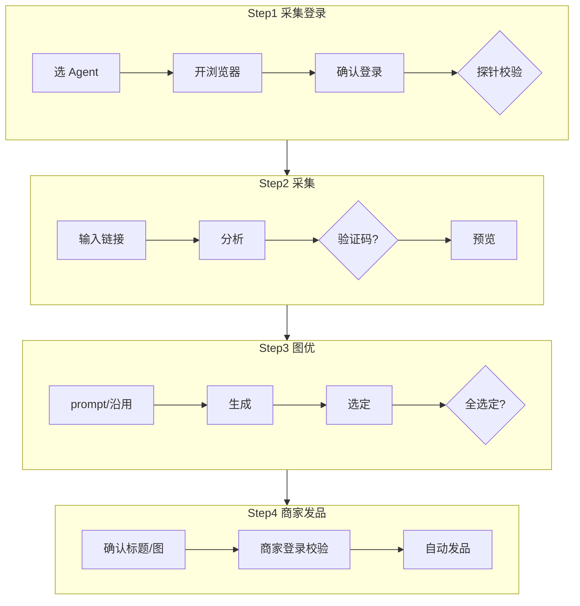

# 功能规格：1688 竞品向导四步

**日期**：2026-07-23  
**对齐**：[README](./README.md)

---

## 1. 总览



### 状态机

```
draft → session_pending → session_valid →
collecting → collected →
img_editing → img_ready →
publishing → published | failed
```

| 当前 | 前进条件 | 可退 |
|------|----------|------|
| Step1 | 采集会话 valid | — |
| Step2 | 有 ≥1 主图 | → Step1 |
| Step3 | 全 Slot selected | → Step2 |
| Step4 | 用户提交 | → Step3 |

### Workflow 创建

```
选 Agent → POST /workflows → draft
→ open-login → session_pending
→ confirm + 探针 → session_valid
```

无 `workflow_id` 不得采集/图优/发品。

---

## 2. Step1 — 采集登录

- 选在线 Agent →「打开登录」→ Agent 开 1688 登录页  
- 用户登录后「我已登录」→ 同步 Cookie（加密落库）→ 探针校验  
- 探针：`GET https://sycm.1688.com/ms/common/information.json`，`code==0`  
- 失败：可重试；前端永不展示 Cookie 明文  

**不做**：自动过码；本步不要求商家后台登录。

---

## 3. Step2 — 采集

- 输入 `detail.1688.com/offer/...` →「分析」  
- Agent CDP 取 HTML → **解析移植自** `D:\reverselab\1688-\fetch_1688_offer.py`  
- 预览：标题、主图、副图、SKU、价格区间  
- 验证码：提示在 Agent 浏览器过完 →「已完成」重试  
- MVP：无 Agent 则失败枚举，**不**静默 Onebound  

成功门槛：标题 + ≥1 图 + SKU。

---

## 4. Step3 — 图优

- Slot0 主图 + Slot1–9 副图（上限 9）  
- 每 Slot：原图、prompt、生成、沿用原图、选定  
- API：仅 `POST .../images/generate|regenerate|select|use-original`  
- 内部：Workflow images → Server → `AiEditImage` → **hyhacct**；写 `listing_1688_image_jobs`  
- **禁止**向导直调 `produce_images`  

默认 prompt：保持商品主体，优化背景光影与构图，适合电商主图。

前进：全部展示中 Slot 为 `selected`。

---

## 5. Step4 — 自家 1688 商家后台发品

### 前置

- `img_ready`；Agent 在线  
- **1688 商家后台已登录**（与 Step1 采集会话分开校验）  

### 面板

- 可改标题；选定图预览  
- 文案明确：「发布到自家 1688 商家店」  
- 不展示妙手/店小秘相关选项  

### 流程

1. `POST .../publish`  
2. Server 组装发品载荷（标题+选定图+SKU 等）  
3. 下发 Agent **商家发品自动化**（填发品页 / 提交）  
4. 成功 → `published`；失败 → `failed` + 枚举  

**禁止**：`AlibabaFactory.ProductIssue`、妙手 `alibaba_collect_box`、店小秘、`RunListing1688` 整链。

失败引导：「请在 Agent 浏览器登录 1688 **商家中心**后重试」。

---

## 6. 入口

| 路径 | 用途 |
|------|------|
| `/1688-auto-upload` | 矩阵；增加向导入口 |
| `/1688-auto-upload/wizard` | 本向导 |
| `/1688-auto-upload/listing` | v1 一键（保留） |
