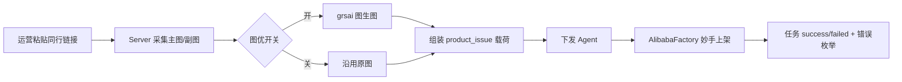

# 1688 采集同行链接 + 图生图优化再上架 — 设计说明

**日期**：2026-07-20  
**状态**：已确认（可写实施计划）  
**落地**：Commander Web / Server / Agent（三端扩展，非独立仓）  
**参考**：现有 `product_issue` 流水线、`ai_images` 生图、`AlibabaFactory` 空实现；妙手导入结构可参考 AE，但 **1688 ≠ 速卖通**，禁止混用平台 API / 工厂

### 已锁定决策（2026-07-20）

| # | 决策 | 结论 |
|---|------|------|
| 1 | 上架通道 | **MVP 必须打通妙手 1688 导入**；`LISTING_1688_PUBLISH_UNSUPPORTED` 仅作联调失败应急，**不是**可签署的 MVP 退出标准 |
| 2 | 入口形态 | **优先粘贴同行链接**；Excel 批量同行链接列为二期 |
| 3 | 副图图优上限 | **默认 9**（主图 1 + 副图 ≤9，合计图优张数按实现：主图必做 + 副图截断至 9） |

---

## 1. 背景与目标

### 1.1 业务背景

公司内 1688 新品当前流程为：

1. 运营在 **妙手 ERP** 采集同行商品链接  
2. 直接将同行主图 / 副图等素材上架到 1688  

运营诉求：采集后、上架前，对主图、副图做一次 **图生图（img2img）** 优化，再上架，降低「原图直搬」风险并统一素材风格。

### 1.2 系统现状（代码事实）

| 能力 | 现状 |
|------|------|
| 1688 自动上架入口 | Web 已有路由 `/1688-auto-upload`，复用 `auto-upload.vue` |
| Agent `AlibabaFactory.ProductIssue` | **空实现**（返回「1688商品发布暂未实现」） |
| 图生图 | **上游 grsai**；业务口 `POST /api/v1/ai/produce_images` + 表 `ai_images`（**禁止** Lyncr） |
| 同行详情拉取 | Server Onebound：`GetProductDetailBy1688`（含 `ItemImgs`） |
| 订单 / 关键词 / 爬虫 | 已有，与「上架」无关，本需求 **不得改坏** |

结论：**系统内没有完整的 1688 上架闭环**；需在现有自动上架协议上 **补齐 1688 分支**，并插入「采集图 → 图优」步骤，而不是另起一套 UI / 任务体系。

### 1.3 本阶段目标（MVP）

跑通最小闭环：

```
输入同行 1688 链接 → 拉取主图/副图 → 图生图更新 → 写入上架任务 → Agent 经妙手上架 → 任务列表可见结果
```

硬性约束：

- **统一**走现有 `product_issue` / 自动上架 UI，不平行造「第二套上架页」
- **报错用枚举**（见技术文档）
- **数据表按需新增**，不改既有表语义
- **隔离**：`platform != 1688` 的路径零行为变化
- **最小实现**：禁止过度抽象、禁止超前做批量调度/智能选品

### 1.4 非目标（MVP 明确不做）

- 替换运营在妙手里的全部操作习惯（仅覆盖「采集后图优再上架」主路径）
- 脱离妙手、直连 1688 官方开放平台发品（可列为二期）
- 自动破解滑块 / 短信
- 多店高并发调度、智能比价、标题 SEO 大改
- 改动 Temu / 速卖通 / Ozon 生图张数、提示词、Excel 模板逻辑

---

## 2. 方案选型

| 方案 | 说明 | 结论 |
|------|------|------|
| A. 扩展现有 `product_issue` + `platform=1688` | 复用 Web 自动上架、任务列表、**grsai** 生图、Agent 工厂 | **采用** |
| B. 独立新仓（类似 AE CSP MVP） | 与 Commander 割裂，UI 难复用 | 否 |
| C. 仅做图优工具、上架仍全手工妙手 | 不满足「统一上架逻辑」 | 否（可作降级兜底） |

推荐 A 的理由：路由与 UI 已在位；Server 已有图生图；Agent 仅需填 `AlibabaFactory`；改动面最小且可按平台分支隔离。

---

## 3. 目标流程



### 3.1 输入

- 同行商品 URL 或 `num_iid`（至少一种）
- 目标店铺 / Agent（复用现有选择器）
- 可选：图优 prompt 模板 ID 或固定默认 prompt（MVP 用常量配置，不做复杂模板中心）

### 3.2 输出

- 任务记录（现有 Agent 任务表 / 协议消息）
- 图优前后图片 URL 对照（新表或任务 `raw` JSON）
- 妙手侧可见草稿/在售商品（验收以业务确认口径为准）

---

## 4. 模块边界

| 模块 | 职责 | 复用 / 新建 |
|------|------|-------------|
| Web `auto-upload` | 1688 入口、任务列表、失败列表 | **复用**；仅加「同行链接」输入区（或 Excel 一列） |
| Web `ai-image` / `produce_images` API | 人工补生图、排障 | **复用**，不改页面结构 |
| Server 采集 | 按链接取主图+副图 | **新建薄服务**，内部调 Onebound（已有） |
| Server 图优 | 对采集图批量 img2img | **grsai**（经 `produce_images` / `AiEditImage`；禁止 Lyncr） |
| Server 任务编排 | `platform=1688` 分支 | **扩展** `RunProductIssue` 或旁路 `RunListing1688`（推荐旁路函数，避免污染 Temu 五场景逻辑） |
| Agent `AlibabaFactory` | 妙手导入发品 | **实现**（参考 `AliExpressFactory` 最小路径） |
| 错误枚举 | 采集/图优/上架失败码 | **新建** `constants/listing_1688_error.go` |
| 数据表 | 采集与图优审计 | **新建** 1 张（见技术文档） |

---

## 5. 隔离与稳定性

1. 所有新逻辑入口判断 `platform == "1688"`；其它平台 `switch` 走原分支。  
2. 禁止修改 Temu/Ozon「必须 5 张场景图」等硬编码以适配 1688；1688 使用独立图片数量规则（主图 1 + 副图 N，N 上限可配置，默认 ≤ 9）。  
3. 新表、新枚举、新 API 路径加前缀 `listing_1688` / `Listing1688`，避免与 `ai_images`、`reptile_product` 语义混淆。  
4. 关键路径加简短中文注释：意图、平台隔离点、禁止事项。  
5. 失败只写枚举码 + 人话 message；禁止把上游堆栈直接甩给运营 UI。

---

## 6. 风险与降级

| 风险 | 降级 |
|------|------|
| 妙手 1688 导入接口与 AE 不一致 | MVP 先固化抓包/对照接口；未通前只做到「图优完成 + 导出素材包」，上架标记 `LISTING_1688_PUBLISH_UNSUPPORTED` |
| Onebound 详情缺图 | 任务失败 `LISTING_1688_COLLECT_NO_IMAGE`；允许用户手动上传参考图走原 `product_issue` |
| grsai 部分失败 | 与现网一致：任一张失败则整单失败（不做静默混用原图，避免「以为已图优」） |
| 影响其它平台 | 合入前必须跑 Temu/AE 冒烟（见测试文档回归门闸） |

---

## 7. 验收摘要

1. 输入合法同行链接，任务能完成采集 → 图优 →（若妙手已通）上架。  
2. 图优后 URL ≠ 采集原 URL（允许 CDN 重写，但内容经业务抽检为「已改图」）。  
3. Temu / 速卖通既有上架用例无回归。  
4. 失败场景返回稳定错误枚举，前端可映射文案。  
5. 代码可读：平台分支清晰，无大段复制粘贴造轮子。

---

## 8. 关键决策（已确认）

1. **上架通道**：MVP **必须**打通妙手 **1688** 导入（非速卖通 AE 导入 API）。  
2. **入口形态**：优先「粘贴同行链接」；Excel 为二期。  
3. **副图数量**：图优副图上限 **9**。

平台隔离（硬性）：1688 主国内、速卖通主国外；`AlibabaFactory` 不得调用 `AliExpressFactory` / AE 专用 Resty；文档与代码注释禁止把两平台写成同一条链路。
