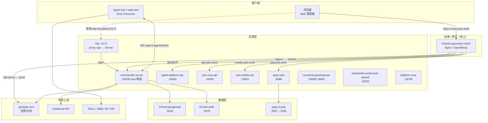
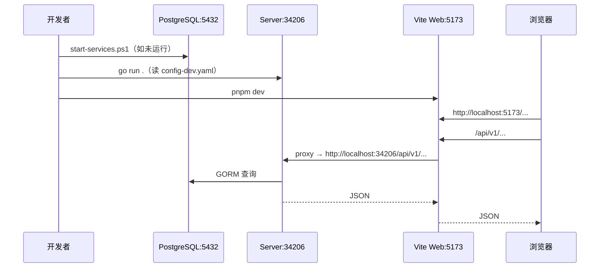
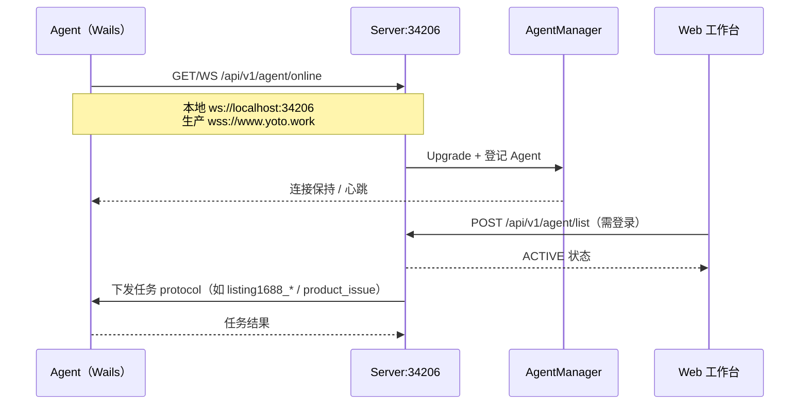
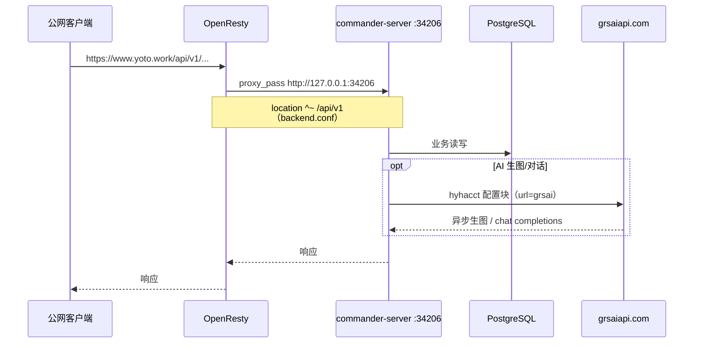
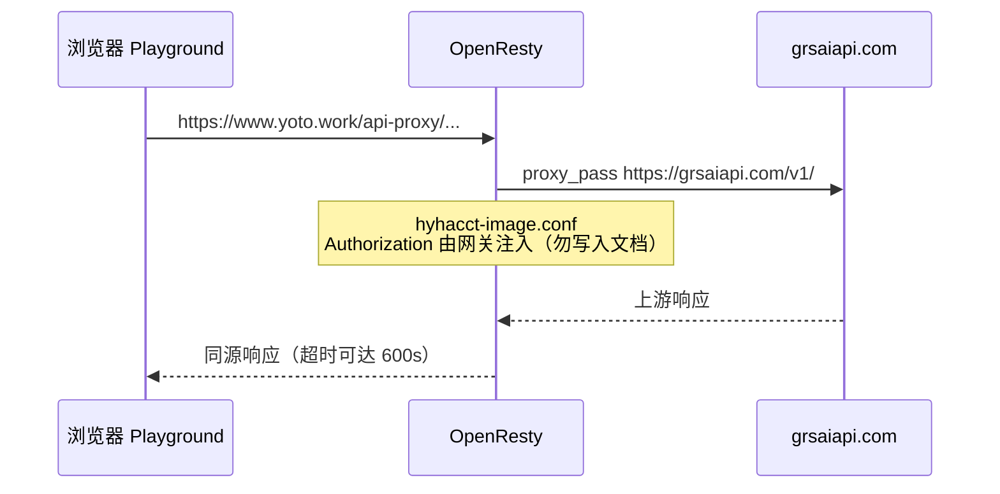
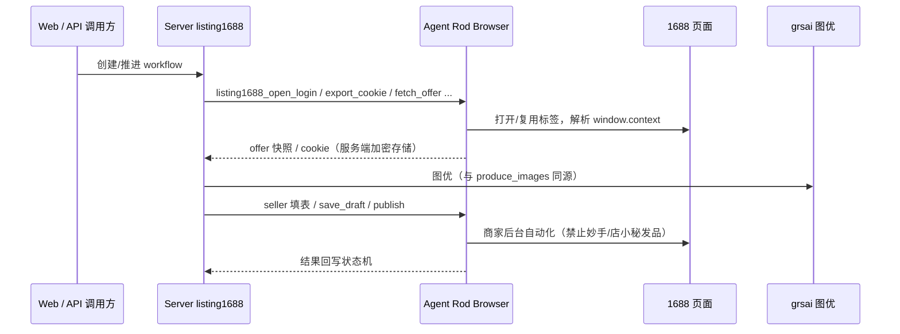

# Commander 工作区 — 全量交接文档

> 工作区根目录：`D:\dev\workspace`  
> 生成时间：**2026-07-30 13:49**（只读 SSH 核实容器/反代：同日）  
> 文档定位：环境与运维底座（架构 / 时序 / 服务器 / DB / Nginx / 反代 / Cookie 路径）  
> 日常断点状态请看：[`交接文档.md`](./交接文档.md)  
> 逐次流水请看：[`开发文档.md`](./开发文档.md)  
> Agent 硬规则请看：[`AGENTS.md`](./AGENTS.md)

**敏感信息口径**：本文只写路径、用途、映射关系；**不写**密码、Token、api_key、cookie 原文。密钥在本地/线上 `config.yaml` 中维护，禁止提交 git。

---

## 0. 文档元信息与分工

| 文档 | 用途 |
|------|------|
| 本文件 `交接文档-全量.md` | 全量底座：架构、时序、服务器、DB、容器、Nginx、反代、公网地址、Cookie 路径 |
| `交接文档.md` | 当前停点、下一步、已推翻结论 |
| `开发文档.md` | 任务流水账（顶部追加） |
| `AGENTS.md` | Agent 执行边界、启动、Git、部署禁令 |
| `docs/handover/` | 历史归档与专项快照 |

| 范围 | 说明 |
|------|------|
| 本地 | Windows 开发机：`D:\dev\workspace` + `D:\dev\env` |
| 线上 | `124.223.27.98`（1Panel + OpenResty + Docker） |
| 核实方式 | 本地读配置/源码；线上 **只读** `docker ps` / `inspect` / `ss` / `cat proxy/*.conf` / `curl` 健康检查 |

---

## 1. 架构总览

### 1.1 子项目表

| 子项目 | 路径 | 技术栈 | 职责 | 默认端口 |
|--------|------|--------|------|----------|
| **Web** | `commander-web-t260220-main/commander-web-t260220-main` | Vue3 + Vite + TDesign | 管理端 / 营销页 / 工作台 | **5173** |
| **Server** | `commander-server-t260220-main/commander-server-t260220-main` | Go + Gin + GORM + PostgreSQL | HTTP API + Agent WebSocket | **34206** |
| **Agent** | `commander-agent-t260220-main/commander-agent-t260220-main` | Wails v2 + Go + Vue3 | 桌面客户端（浏览器自动化 / 上架） | 连 Server；内嵌 Vite **34115** |
| **CSP 工具** | `aliexpress-csp-auto-upload` | Python + Playwright | 速卖通 CSP 录制 / replay / 填表上架 | 本机脚本 |
| **环境工具链** | `D:\dev\env` | Go / Node / pnpm / PostgreSQL | 本机运行时 | PG **5432** |

**外部源码（非本仓主战场）**

| 角色 | 路径 |
|------|------|
| 1688 采集已实现源码 | `D:\reverselab\1688-`（移植解析，禁止从零重写） |
| 公共逆向仓 | `D:\reverselab\open-reverselab`（非 Commander 主战场） |

### 1.2 逻辑架构图

### 1.3 本地 vs 线上对照

| 能力 | 本地 | 线上 |
|------|------|------|
| Web | `pnpm dev` → `:5173`，Vite 反代 `/api` → `localhost:34206` | 静态站 `www.yoto.work`（1Panel 站点目录） |
| Server | `go run .`，`ENV=dev` 读 `config-dev.yaml` | 容器 `commander-server-t260220`，**host 网络** 听 `*:34206` |
| Agent | `wails dev`，`BaseServerAddress=localhost:34206` | 用户桌面安装包；生产应连 `wss://www.yoto.work`（发布前切回） |
| DB | 本机 PostgreSQL `D:\dev\env\data\postgresql` | `1Panel-postgresql-seRU` |
| 配置 | `etc/config/config-dev.yaml` | `/data/commander/config/config.yaml` → 容器 `/apps/data/etc/config` |

---

## 2. 关键时序

### 2.1 本地启动与 Web 调 API

### 2.2 Agent 上线（WebSocket 注册）

### 2.3 线上公网请求进入 Server

### 2.4 Playground 同源 `/api-proxy`（浏览器直连上游）

### 2.5 1688 向导（Server 编排 + Agent 浏览器）概要

---

## 3. 服务器信息

| 项 | 值 |
|----|-----|
| 公网 IP | `124.223.27.98` |
| SSH | `ssh root@124.223.27.98`（凭据本地维护，**本文不写密码**） |
| 面板 | 1Panel |
| 站点根 | `/opt/1panel/www/sites/` |
| Commander 数据 | `/data/commander/`（`config/`、`backups/`） |
| 同机共存 | ybb-site（`/opt/ybb-site`）；crosshub 占 `18080`；SOCKS 约定本机 `127.0.0.1:19888`（**勿用 18080**） |

**允许（只读）**：`docker ps`、`docker logs`、`docker inspect`、`curl` 健康检查、读 nginx conf。  
**禁止（除非本轮明确要求）**：scp 上传、改 `/data/commander`、`docker restart` 部署、替换二进制、改站点文件。

部署脚本目录（须用户明确要求才执行）：`scripts/_ssh-probe/`  
主入口示例：`restore-config-and-deploy.js`（上传 `payload/config.yaml` + Linux 二进制并重启容器）。

---

## 4. 数据库信息

### 4.1 PostgreSQL（Commander 主库）

| 项 | 本地 | 线上（2026-07-30 核实） |
|----|------|-------------------------|
| 引擎 | PostgreSQL | 容器 `1Panel-postgresql-seRU`（healthy） |
| 端口 | `5432` | `0.0.0.0:5432` |
| 数据目录 | `D:\dev\env\data\postgresql` | 1Panel 卷（具体宿主机路径 `待核实`） |
| 库名 | `commander`（见 `config-dev.yaml` DSN） | `commander`（业务脚本常用） |
| 账号 | 见本地 DSN（勿提交） | 业务用户常见 `commander` / 管理 `postgres`（密码在线上 config，勿写入文档） |
| 连接配置 | `etc/config/config-dev.yaml` → `database.dsn` | `/data/commander/config/config.yaml` → `database.dsn` |

### 4.2 Redis

| 项 | 本地 | 线上 |
|----|------|------|
| 用途 | 会话 / 缓存（`redis.enabled`） | 容器 `1Panel-redis-zyzq`，`0.0.0.0:6379` |
| 配置 | `config-dev.yaml` → `redis` | 线上 `config.yaml` → `redis` |

### 4.3 其他库（同机，非 Commander 主路径）

| 组件 | 容器 | 端口 | 用途 |
|------|------|------|------|
| Epay MySQL | `epay-mysql` | `127.0.0.1:3307→3306` | `pay.yoto.work` |

---

## 5. 服务器项目与容器

### 5.1 2026-07-30 线上 `docker ps` 摘要

| 容器名 | 状态摘要 | 端口映射 | 备注 |
|--------|----------|----------|------|
| `commander-server-t260220` | Up | **host 网络** `*:34206` | 镜像 `ghcr.io/hyhacct/commander-server-t260220:v0.0.18-x86_64`；restart=always |
| `1Panel-postgresql-seRU` | healthy | `5432` | 主库 |
| `1Panel-redis-zyzq` | Up | `6379` | Redis |
| `1Panel-openresty-UN3Y` | Up | （面板托管） | 网关 |
| `yoto-new-api` | healthy | `127.0.0.1:18300→3000` | `api.yoto.work` |
| `yoto-media-oss` | Up | `127.0.0.1:18301→3000` | `media.yoto.work` |
| `epay-web` | Up | `127.0.0.1:8088→80` | `pay.yoto.work` |
| `epay-mysql` | Up | `127.0.0.1:3307→3306` | 支付库 |
| `agent-platform-api` | Up | `127.0.0.1:18000→8000` | `/agent-platform/` |
| `platform-mcp` | Up | `127.0.0.1:18765→18765` | `/platform-mcp/` |
| `crosshub-java` | Up | `127.0.0.1:18080→18080` | crosshub |
| `crosshub-express` | Up | `127.0.0.1:18081→18081` | crosshub |
| `automedia-social-auto-upload` | Up | `127.0.0.1:18302→5409` | autoMedia |
| `1Panel-openlist-SSrO` | Up | `5244/5246` | 网盘类 |
| `250210-mihomo` | Up | — | 代理相关 |

### 5.2 Commander 挂载与二进制

| 项 | 值 |
|----|-----|
| 挂载 | `/data/commander/config` → 容器 `/apps/data/etc/config` |
| 配置文件 | 宿主机 `/data/commander/config/config.yaml` |
| 版本文件 | 宿主机 `/data/commander/config/version.yaml` |
| 进程入口 | 容器内 `/usr/local/bin/app`（部署脚本 `docker cp` 替换） |
| 健康检查 | `curl http://127.0.0.1:34206/api/v1/openapi/agent_version` → **HTTP 200**（已核实） |

本地上传用配置副本：`scripts/_ssh-probe/payload/config.yaml`（含密钥，**禁止 git 提交**）。  
本地 Linux 二进制：`commander-server-.../.local/bin/commander-server-linux-amd64`。

---

## 6. Nginx / OpenResty 配置

### 6.1 路径约定

| 用途 | 路径 |
|------|------|
| 站点根 | `/opt/1panel/www/sites/<server_name>/` |
| www 反代片段 | `/opt/1panel/www/sites/www.yoto.work/proxy/*.conf`（自动 include） |
| www 静态/下载 | `/opt/1panel/www/sites/www.yoto.work/index/`（含 `downloads/`） |
| 访问/错误日志 | `/opt/1panel/www/sites/<site>/log/` |
| 本地 conf 副本 | `scripts/_ssh-probe/payload/*.conf` |

### 6.2 www.yoto.work 已落地 proxy 片段（2026-07-30）

| 文件 | 作用 |
|------|------|
| `backend.conf` | `/api/v1` → `127.0.0.1:34206`（含 WebSocket Upgrade，超时 600s） |
| `hyhacct-image.conf` | `/api-proxy/` → `https://grsaiapi.com/v1/`（超时 600s；Bearer 网关注入） |
| `grsai-image.conf` | DEPRECATED 占位，实际逻辑在 `hyhacct-image.conf` |
| `agent-platform.conf` | `/agent-platform/` → `127.0.0.1:18000/` |
| `platform-mcp.conf` | `/platform-mcp/` → `127.0.0.1:18765/`（长连接 3600s） |
| `crosshub.conf` | 多 path → `18080/18081` |
| `playground-timeouts.conf` | Playground 相关超时 |

---

## 7. 反代 ↔ 容器内接口映射

| 外部 URL / 路径 | Nginx location | 反代目标 | 容器/进程 | 协议 | 鉴权 | 健康/备注 |
|-----------------|----------------|----------|-----------|------|------|-----------|
| `https://www.yoto.work/api/v1/*` | `^~ /api/v1` | `http://127.0.0.1:34206` | `commander-server-t260220`（host） | HTTP + WS | JWT（业务路由）/ Agent WS | `GET /api/v1/openapi/agent_version` → 200 |
| `wss://www.yoto.work/api/v1/agent/online` | 同上 | 同上 | 同上 | WebSocket | Agent 注册 | 本地：`ws://localhost:34206/api/v1/agent/online` |
| `https://www.yoto.work/api-proxy/*` | `^~ /api-proxy/` | `https://grsaiapi.com/v1/` | 外部上游 | HTTPS | 网关 Bearer | 生图长超时 |
| `https://www.yoto.work/agent-platform/*` | `^~ /agent-platform/` | `http://127.0.0.1:18000/` | `agent-platform-api` | HTTP | 应用自有 | body 64m |
| `https://www.yoto.work/platform-mcp/*` | `^~ /platform-mcp/` | `http://127.0.0.1:18765/` | `platform-mcp` | HTTP/WS | 应用自有 | 超时 3600s |
| `https://api.yoto.work/` | `/` | `http://127.0.0.1:18300` | `yoto-new-api` | HTTPS | 应用自有 | payload `api.yoto.work.conf` |
| `https://media.yoto.work/` | `/` | `http://127.0.0.1:18301` | `yoto-media-oss` | HTTPS | 应用自有 | body 可至 5120m |
| `https://pay.yoto.work/` | `/` | `http://127.0.0.1:8088` | `epay-web` | HTTPS | 应用自有 | payload `pay.yoto.work.conf` |

### 7.1 Server 核心路由前缀（容器内真实接口）

基路径：`/api/v1`

| 模块 | 前缀 | 说明 |
|------|------|------|
| user | `/user/*` | 注册登录 / 会话 |
| agent | `/agent/online`、`/agent/status`、任务与店铺等 | WS 上线 + 业务 |
| openapi | `/openapi/agent_version`、`vision_images`、temu 上传等 | 开放接口 |
| ai | `/ai/*` | 生图等 |
| listing1688 | `/listing1688/*` | 1688 向导 |
| ae_csp | `/ae_csp/*` | AE CSP |
| sale / ticket / reptile / express / invitation | 对应前缀 | 业务模块 |

---

## 8. 外部网站与公网地址

| 用途 | 公网 URL | 对应内部 |
|------|----------|----------|
| 主站 / 管理端静态 | `https://www.yoto.work` | OpenResty 站点 + `/api/v1` → Commander |
| API（NewAPI） | `https://api.yoto.work` | `:18300` |
| 媒体 OSS | `https://media.yoto.work` | `:18301` |
| 支付 | `https://pay.yoto.work` | `:8088` |
| Agent 下载 | `https://www.yoto.work/downloads/Agent_windows_amd64_<tag>.zip` | `index/downloads/`（已见 4.0.1–4.0.3） |
| Agent 版本接口 | `https://www.yoto.work/api/v1/openapi/agent_version` | Server openapi |
| GPT Image Playground | `https://www.yoto.work/gpt-image-playground/` | 静态 + `/api-proxy` |
| autoMedia | `https://autoMedia.yoto.work`（站点目录存在） | automedia 容器 |
| open | `https://open.yoto.work`（站点目录存在） | `待核实` 业务详情 |

### 8.1 本地开发 URL

| 用途 | URL |
|------|-----|
| Web | `http://localhost:5173` |
| Server API | `http://localhost:34206` |
| Agent 内嵌前端 | `http://127.0.0.1:34115`（仅 WebView，勿当网站） |
| Agent WS | `ws://localhost:34206/api/v1/agent/online` |

---

## 9. Cookie / 会话 / 浏览器数据存储路径

| 用途 | 存储路径 | 格式 | 谁读写 | 可提交 git？ | 清理 |
|------|----------|------|--------|--------------|------|
| Agent Chromium Profile | `commander-agent-.../agent/Browser/` | Chromium user-data-dir | Agent Rod | **否** | 进程侧 stale 清理；勿手删正在使用的 profile |
| Agent 日志 | `commander-agent-.../agent/logs/` | 文本 | Agent | **否**（可本地保留） | 按需 |
| Agent 本地配置 | `commander-agent-.../agent/config.yaml` | yaml | Agent | **否**（含账号） | — |
| Server JWT 会话 | Redis（`redis.*`） | key-value | Server | — | logout / expire |
| 1688 Cookie（服务端） | DB 字段（加密，依赖 `LISTING_1688_COOKIE_KEY` 等环境） | 密文 | Server | **否** | 业务失效/重登 |
| AE CSP cookie | `aliexpress-csp-auto-upload/cookies/csp_<account>.json` | Playwright `storage_state` | CSP 工具 | **否** | 重新 `ae-csp login` |
| AE CSP 账号 yaml | `aliexpress-csp-auto-upload/accounts/<account>.yaml` | yaml | CSP 工具 | **否** | — |
| CSP captures | `aliexpress-csp-auto-upload/captures/` | 录制产物 | 工具/人 | 默认不提交敏感 | 按需 |

**硬规则**：禁止把 cookie 内容写入 `交接文档*`、`开发文档.md`、日志汇报或 git。

---

## 10. 密钥与配置（脱敏）

| 配置项 | 本地路径 | 线上路径 | 用途 |
|--------|----------|----------|------|
| Server 主配置 | `etc/config/config.yaml`、`config-dev.yaml` | `/data/commander/config/config.yaml` | 端口、DSN、Redis、hyhacct、onebound、JWT |
| 部署用配置副本 | `scripts/_ssh-probe/payload/config.yaml` | 上传覆盖线上 | 发布 |
| Agent 版本清单 | `etc/config/version.yaml` | `/data/commander/config/version.yaml` | Web/Agent 更新列表 |
| Agent 常量 | `backend/internal/constants/agent.go` | 编进二进制 | `AgentVersion`、`BaseServerAddress` |
| hyhacct 块 | yaml `hyhacct:`（结构名不变） | 同左 | 当前上游 `https://grsaiapi.com`；模型 `gpt-image-2` / `gpt-5.5`；`chat_protocol: chat_completions` |
| 环境变量 | 用户/系统：`ENV=dev`、`FISHAGENT_*` | 容器/宿主机 | 本地切 `config-dev.yaml` |

**禁止提交**：`config.yaml` 密钥、`.env`、cookie、Bearer、SSH 密码。

---

## 11. 日志与排错入口

| 组件 | 日志位置 | 先查什么 |
|------|----------|----------|
| 线上 Server | `docker logs commander-server-t260220` | 启动失败、DSN、任务错误 |
| 线上 OpenResty 访问 | `/opt/1panel/www/sites/www.yoto.work/log/access.log` | `/api/v1`、`/api-proxy` 状态码 |
| 线上 OpenResty 错误 | 同目录 `error.log` / openresty 全局 error | 502/504 upstream |
| 本地 Agent | `agent/logs/`（含 collect-debug-*） | WS 是否进任务、1688 软拦截 |
| 健康检查 | `curl -I https://www.yoto.work/api/v1/openapi/agent_version` | `code` 业务体 + HTTP |

典型顺序：公网 HTTP 码 → OpenResty error → `ss`/容器是否听端口 → `docker logs` → 配置挂载是否存在。

---

## 12. Git / 发布 / 同步边界

| 仓库 | Remote |
|------|--------|
| server | `https://github.com/hyhacct/commander-server-t260220` |
| web | `https://github.com/hyhacct/commander-web-t260220` |
| agent | `https://github.com/hyhacct/commander-agent-t260220` |
| 工作区文档等 | 根仓 / `smart-agent` 等按实际 remote |

**代码出口**：commit + push GitHub。  
**服务器更新**：仅当用户本轮明确要求；优先 `scripts/_ssh-probe/restore-config-and-deploy.js`。  
**Agent 发版**：`wails build` → 公网 zip（`www.yoto.work/downloads/...`）→ 更新 `version.yaml`（`AgentVersion` 必须一致）→ 用户要求后再上传线上 `version.yaml`。

生产发布前 Agent：`BaseServerAddress` 必须为生产 `wss` + `www.yoto.work`（不要带 localhost）。

---

## 13. 安全禁忌与授权边界

- 禁止提交 cookie / Token / 密码 / 真实密钥配置。
- 禁止未授权远程部署、重启、替换线上文件。
- 禁止把 HTTP 200 当业务成功（上架/支付等看业务返回与列表可见性）。
- 禁止未经确认的真实发品 / 上架。
- 全权执行授权**不覆盖**上述禁令。

---

## 14. 接手检查清单

- [ ] 读完 `AGENTS.md` §远程部署禁止项
- [ ] 本地：`ENV=dev`，能 `go run` Server，`curl localhost:34206/api/v1/openapi/agent_version`
- [ ] 本地：Web `5173` 与 Agent `34115` 未混用
- [ ] 本地：Agent WS 注册后 Web 显示 ACTIVE
- [ ] 只读 SSH：`docker ps` 见 `commander-server-t260220`、PG、OpenResty
- [ ] `ss`/`curl`：宿主机 `34206` 健康 200
- [ ] 核对 `backend.conf`：`/api/v1` → `127.0.0.1:34206`
- [ ] 核对 `hyhacct-image.conf`：`/api-proxy` → grsai（非过期 hyhacct NewAPI，除非配额策略变更）
- [ ] Cookie 目录存在且未被 git 跟踪：`agent/Browser/`、`aliexpress-csp-auto-upload/cookies/`
- [ ] 不把 `payload/config.yaml` 加入 git
- [ ] 日常停点以 `交接文档.md` 为准，底座以本文为准

---

## 15. 当前可接手结论

1. 线上 Commander Server 以 **host 网络** 监听 **34206**，配置挂载在 `/data/commander/config`，健康检查 **200**。  
2. 公网主入口为 **www.yoto.work** → OpenResty → `/api/v1` 打到本机 34206；生图 Playground 走 `/api-proxy` → **grsaiapi.com**。  
3. 本地三端端口铁律：Web **5173** / Server **34206** / Agent 内嵌 **34115**；Cookie 在 `agent/Browser` 与 CSP `cookies/`。  
4. 同机还有 NewAPI / Media / Epay / crosshub / automedia / MCP，改端口或反代时勿踩 **18080**。  
5. 业务停点与下一步仍以 [`交接文档.md`](./交接文档.md) 为准；部署须用户明确点名。

---

## 16. 本次待核实清单

| 项 | 状态 |
|----|------|
| 线上 PG 数据卷宿主机绝对路径 | 待核实 |
| `open.yoto.work` / `autoMedia.yoto.work` 完整业务说明 | 待补专章 |
| `version.yaml` 最新 `is_new` 与 Agent 二进制显示版本是否已对齐 4.0.3 | 待核对 |
| ybb-site systemd 单元当前状态 | 待只读复核 |
| 线上 `config.yaml` 内 hyhacct.url 是否已与本地口径一致（grsai） | 待脱敏核对（只读 grep url 字段） |
